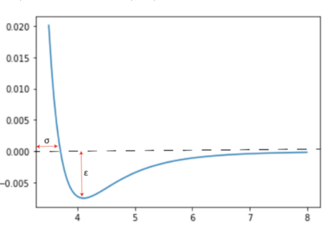

# Simulación de partículas

Simulación de un conjunto de partículas que se mueven bajo la acción de potencial de Lennard-Jones.  Este potencial es de la forma:

 

 donde  es la distancia de los centros de dos partículas,  es la distancia finita entre partículas para la cual el potencial es 0 y  indica la profundidad del pozo de pontencial.

 
 

  

 Este potencial tiene un comprtamiento interezante dado que este atractivo a grandes distancias y es repulsivo a corsas distancias.
 
 La simulación se realiza en 3 etapas distintas:
 1. Se genera una configuración inicial generando una determinada cantidad de particulas en una caja cuadrada de lado L.
 2. La configuración inicial generada se mueve buscando una configuración de mínimo potencial mediante una simulación de tipo Metrópolis.
 3. Se genera una animación que muestra como evoluciona el sistema.
